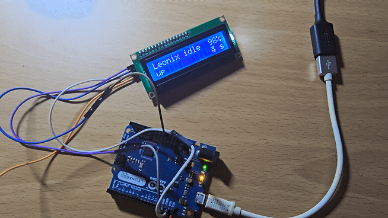
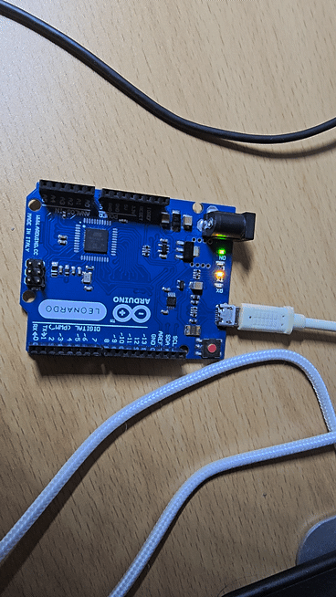
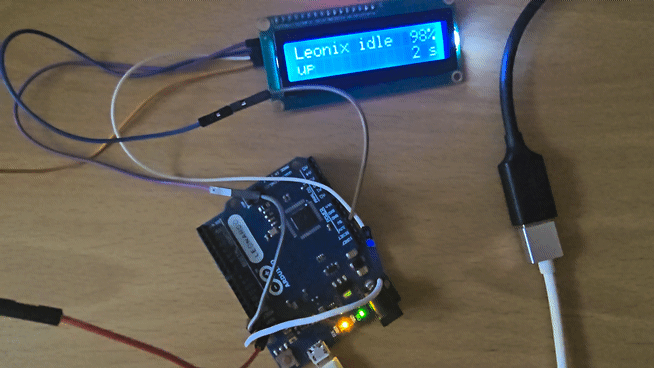

.. SPDX-License-Identifier: GPL-2.0-only

====================
上下文切换与轮转调度
====================

**上下文切换** (context switch) 是保存一个任务的处理器状态,
再恢复另一个任务的处理器状态的操作. Leonix 按固定顺序依次选取下一个任务,
这种选取方式被称为轮转调度 (round-robin). 提交 d4fcdd3 (2026-10-08)
实现了最初的版本: 每次 1 ms 节拍中断都强制切换, 任务只能忙等.
本文描述其后加入睡眠与空闲任务的实现, 两者不同之处逐节注明.
文中的周期数与栈用量取自 avr-gcc 9.5.0 以 -Os 编译的结果.

任务的现场
==========

一个任务在某一时刻的全部状态由四部分组成: 32 个通用寄存器 r0 至 r31, 状态寄存器
SREG, 程序计数器 PC, 以及栈指针 SP. 只要这四部分原样恢复,
任务就从被打断的那条指令继续执行, 其间经过了多长时间, 任务本身无从得知.

Leonix 给每个任务分配一块独立的栈, 前三部分保存在该任务自己的栈上, SP 保存在
``struct task`` 的 ``sp`` 字段. ``struct task``
另外记录栈的起始地址、唤醒时刻与任务状态, 共 9 字节. 任务表 ``tasks[]`` 最多容纳
MAX_TASKS (4) 项, 空闲任务另占一项, 不计入其中.

一次切换的过程
==============

切换有三个入口: 节拍中断、TWI 中断与 ``arch_yield()``. 节拍中断是其中最早
实现的一个. Timer1 的比较匹配中断每 1 ms 触发一次,
对应向量 ``__vector_17``, 其实现在 arch/avr/switch.S. 中断发生时,
硬件先把当前任务的 PC 压入当前栈, 并清除 SREG 的 I 标志, 随后 switch.S 依次执行:

1. ``save_context``: 把 r0、SREG、r1 至 r31 共 33 字节压入当前任务的栈.
2. ``store_sp``: 把此时的 SP 写入 ``current->sp``.
3. 调用 ``timer_interrupt()``, 递增 jiffies, 再经 ``scheduler_tick()``
   进入 ``schedule()``, 后者选出下一个可运行的任务, 写入 ``current``.
4. ``load_sp``: 从新的 ``current->sp`` 取出 SP.
5. ``restore_context`` 与 ``reti``: 从新任务的栈弹出该任务上次保存的
   寄存器, 再弹出 PC.

第 4 步之后, 栈已经是另一个任务的栈, 因此 ``reti``
返回的是另一个任务被打断的位置.

第二个入口是 ``arch_yield()``, 任务在节拍到来之前主动交出 CPU 时调用.
调用指令已经把返回地址压在中断压入 PC 的位置, 两者的字节顺序也相同,
``arch_yield()`` 因此只需先执行 ``cli``, 再执行与中断相同的第 1 至 5 步. ``cli``
在保存之前执行, 保存下来的 SREG 中 I 标志因而是清除的, 与中断保存的帧一致.

第三个入口是 TWI 中断的向量 ``__vector_36``, 同样写在 switch.S. 该向量先以
相同的方式保存现场, 再调用 ``twi_interrupt()`` 推进当前的 I2C 传输. 传输结束
时 ``twi_interrupt()`` 唤醒等待的任务并返回被唤醒的任务数, 向量据此决定是否
调用 ``schedule()``. 当场切换使 I2C 的调用者在传输结束后立即继续运行, 不必
等待最长 1 ms 后的下一个节拍. lcd.rst 的"中断驱动的传输"一节说明传输本身.

三个入口保存的帧格式相同, 一个任务无论经由哪个入口被切换出去,
都可以经由另一个入口恢复运行.

任务的状态
==========

``struct task`` 的 ``state`` 取下列四个值之一:

TASK_RUNNABLE
  可以运行. 正在运行的任务也处于这一状态.

TASK_SLEEPING
  在等待 ``wake_at`` 所记的时刻. ``schedule()`` 每次经过该任务时比较
  jiffies, 时刻已到就改回 TASK_RUNNABLE. 带超时的等待也处于这一状态,
  此时 ``wake_up()`` 可以在时刻到达之前唤醒该任务.

TASK_BLOCKED
  在等待队列上等待, 没有截止时刻, 只有 ``wake_up()`` 能使该任务重新变为
  可运行.

TASK_DEAD
  入口函数已经返回. 该任务不再被选中, 其栈也不再被使用.

``schedule()`` 从当前任务的下一项开始, 依次查看任务表中的每一项,
选中第一个可运行的任务, 当前任务排在最后查看. 只有在其他任务都不能运行时,
当前任务才继续占用 CPU. 没有任何任务可以运行时, 选中空闲任务.

睡眠
====

任务调用 ``sleep_until(deadline)`` 进入睡眠. 该函数把 ``wake_at`` 设为
``deadline``, 把状态设为 TASK_SLEEPING, 再调用 ``arch_yield()``. 节拍中断随后每
1 ms 检查一次, jiffies 到达 ``deadline`` 时任务重新变为可运行.

这两项写入在关中断之后进行. ``wake_at`` 是 32 位变量, 要分 4 条指令写入,
若节拍中断落在写入中途, ``schedule()`` 读到的就是新旧两个值拼成的时刻.
状态也必须与 ``wake_at`` 一起生效,
否则中断处理可能读到一个已标为睡眠、唤醒时刻却尚未写入的任务.

参数取绝对时刻, 不取时长. 周期性的任务每轮把截止时刻加上一个周期::

  next_toggle += blink_half_period;
  sleep_until(next_toggle);

任务被唤醒时可能已经晚了若干个节拍, 例如其他任务正占用 CPU.
截止时刻从上一个截止时刻推算, 这次的延迟就不会累积到下一轮. 若写成"睡眠 500 ms",
每一轮的延迟都会叠加, 闪烁的周期随之变长.

``msleep(ms)`` 是按时长睡眠的写法, 供只需要下限的场合使用,
例如液晶屏初始化时的等待. 截止时刻是当前 jiffies 加 ms 再加 1:
调用时当前这个节拍可能即将结束, 只加 ms 时实际睡眠可能比 ms 少将近 1 ms.

等待队列与互斥锁
================

**等待队列** (wait queue) 是等待同一事件的任务的集合. 事件发生的一方调用
``wake_up()``, 队列上的任务随即变为可运行. 等待队列由提交 4528153 加入,
其接口沿用 Linux 的名称: ``wait_event()``、``wait_event_timeout()`` 与
``wake_up()``, 定义在 include/leonix/wait.h. 任务此前只能按时间睡眠; 等待
外设完成一次传输时只能轮询状态位, I2C 驱动因此在每个字节约 90 微秒的传输
期间一直占用 CPU.

``struct wait_queue`` 只有一个字节, 每一位对应任务表中的一项. 任务至多
MAX_TASKS (4) 个, 位图的置位、清除与遍历都是常数开销, 链表则需要在任务的
栈上分配节点. 位图的宽度限制了任务数, sched.c 中的 ``_Static_assert`` 在
MAX_TASKS 大于 8 时使编译失败 (提交 61fc829). 若无此检查, 第 9 个任务的
``1 << current_index`` 在 8 位整数中截断为 0, 该任务挂入队列后不会被任何
``wake_up()`` 唤醒.

``wait_event(wq, cond)`` 循环执行三步: 关中断, 判断 ``cond``, 条件不成立时
调用 ``__wait()`` 把当前任务挂入队列并让出 CPU. 判断与挂入都在关中断的
区间内完成, 这是该设计的要点. 设想两步之间允许中断: 任务判断条件不成立,
随即被 TWI 中断打断; 中断处理程序置位条件并调用 ``wake_up()``, 而此时队列
上还没有该任务, 这次唤醒无人接收; 任务随后挂入队列, 此后不再被唤醒. 这一
情形被称为丢失唤醒 (lost wakeup). ``__wait()`` 经由 ``arch_yield()`` 让出
CPU, ``reti`` 在恢复该任务时重新打开中断.

``wait_event_timeout(wq, cond, ms)`` 另带一个截止时刻, 任务以 TASK_SLEEPING
挂入队列, 时刻到达时由节拍唤醒. 每一轮先读 jiffies, 再判断条件, 沿用提交
97dc0e9 为 I2C 超时定下的顺序 (见下文"抢占带来的错误"一节): 条件成立时
优先返回成功, 截止时刻已过而条件仍不成立才返回超时.

**互斥锁** (mutex) 保证同一时刻至多一个任务进入某段代码, 定义在
include/leonix/mutex.h. ``mutex_lock()`` 以 "锁空闲则上锁" 作为
``wait_event()`` 的条件, 测试与置位因此同在关中断的区间内. ``mutex_unlock()``
清除锁并唤醒全部等待者, 由这些任务重新竞争, 未得到锁的任务再次进入等待.
按到达顺序排队可以避免这种重复竞争, 但需要为每个等待者记录次序; 任务至多
四个, 排队的开销大于收益. 中断处理程序不能睡眠, 因此不能获取互斥锁.

空闲任务
========

所有任务都在睡眠时, ``schedule()`` 选中空闲任务. 空闲任务的代码只有一个循环,
反复执行 avr-libc 的 ``sleep_mode()``, 即置位 SMCR 的 SE、执行 ``sleep``
指令、再清除 SE. ``sched_start()`` 事先把睡眠模式设为 Idle.

Idle 模式只停止 CPU 与 Flash 的时钟, 定时器与中断系统照常运行 (数据手册 7.1 节
). 下一个节拍中断唤醒 CPU, 中断处理中的 ``schedule()`` 若发现睡眠到期的任务,
即切换到该任务. 从睡眠中唤醒比正常响应中断多停顿 4 个周期 (数据手册第 7 章开头
), 与切换本身的开销相比可以忽略.

空闲任务也是一个任务, 有自己的 72 字节栈,
空闲任务被打断时的现场与其他任务一样保存在这块栈上. 空闲状态做成任务之后, ``schedule()``
就不必处理"没有任务可选" 这一特殊情形,
切换代码也不必区分即将恢复的是普通任务还是空闲状态.

``scheduler_tick()`` 在每个节拍检查 ``current`` 是否为空闲任务, 是则把
``idle_ticks`` 加 1. 液晶屏任务每秒读取一次这一计数,
换算成空闲时间的百分比显示在第 0 行. 这是一种抽样: 节拍落在哪个任务上, 这 1 ms
就算作哪个任务的. 睡眠到期的任务恰好在节拍时被唤醒, 运行几十微秒后又进入睡眠,
下一个节拍到来时 CPU 大多已经回到空闲任务, 这段运行因此几乎不会被计入.
节拍中断本身的处理时间也不会被计入: 抽样发生在中断之内, 记录的是中断之前
正在运行的任务. 按 d4fcdd3 的周期数, 中断处理每次约 14 微秒, 占 1.4%,
加入睡眠之后的 ``schedule()`` 只会更长. I2C 改为中断驱动之后, 每个字节触发
一次 TWI 中断, 这部分时间同样不被计入. 显示的百分比因而偏高, 只能用来判断
CPU 大致有多空闲.

百分比的分子与分母必须覆盖同一段时间. 液晶屏任务在每次刷新之前, 于关中断的
状态下一并读出 jiffies 与 ``idle_ticks``, 两者之差分别是窗口内的总节拍数与
空闲节拍数. 提交 71b143e 之前, 空闲计数在刷新完成后才读取, 窗口的起点因此
晚于总节拍的起点, 刷新所占的时间只计入了分母. 该错误的发现过程见下文
"排查: 空闲比例不升反降"一节.

为何用汇编实现中断向量
======================

avr-gcc 的 ``ISR()`` 宏生成的序言只保存处理函数会用到的寄存器,
结语再按同一份清单恢复. 切换需要保存全部 32 个通用寄存器, 并在保存与恢复之间更换
SP, 这两点都无法用 C 表达. jiffies 的递增因此从中断向量中移出, 成为普通的 C 函数
``timer_interrupt()``, 由 switch.S 在保存现场之后调用.

保存时 r1 被清零 (``clr r1``). avr-gcc 约定 r1 恒为 0 (``__zero_reg__``),
被打断的代码可能恰好在临时使用 r1, 调用 C 函数之前必须恢复这一约定.

新任务的初始栈帧
================

从未运行过的任务没有被保存过的现场, 第一次切换到该任务时, ``restore_context``
仍然会从该任务的栈上弹出 33 字节, ``reti`` 再弹出 2 字节. ``task_init()``
因此事先在新栈上构造一份与 switch.S 保存的帧逐字节一致的帧, 自栈顶向下依次为:

- ``task_exit()`` 的地址, 作为入口函数的返回地址
- 入口函数的地址, 作为 ``reti`` 返回的目标
- r0, SREG, r1 至 r31, 全部为 0

两处地址按高字节在低地址的顺序存放, 与 CALL 指令压栈的顺序相同. 入口函数若执行到
``return``, 会返回到 ``task_exit()``. 返回地址缺失时, 跳转目标不可预测.

``task_exit()`` 把任务标为 TASK_DEAD, 再调用 ``arch_yield()``,
此后该任务不会再被选中, 其余任务照常运行. d4fcdd3 的 ``task_exit()``
关闭中断后原地循环, 一个任务的返回会使所有任务一起停止.

帧中的 SREG 取 0, 即 I 标志清除, 与中断内保存的帧相同. I 标志由 ``reti`` 设置.
若在帧内把 I 置位, ``restore_context`` 写回 SREG 时中断即被打开, 而此时 r0
还剩最后一次 ``pop`` 没有执行, 恢复过程中途可能再次进入中断.

这份帧布局在 switch.S 与 kernel/sched.c 两处各写一遍, 两处必须同时修改.
switch.S 文件头的注释记录了这一约束.

SP 的两次写入
=============

AVR 的 SP 由 SPL 与 SPH 两个 8 位寄存器组成, ``load_sp`` 分两条 ``out``
指令写入. 两次写入之间 SP 指向一个无意义的地址, 此时若发生中断, 硬件会把
PC 压到该地址. ``load_sp`` 在三处使用: 节拍中断内部, ``arch_yield()`` 执行
``cli`` 之后, 以及 ``sched_start()`` 执行 ``cli`` 之后的
``arch_start_first_task``. 三处的 I 标志都已清除, 这一写法才是安全的.

栈的预算
========

TASK_STACK_RESERVE 是切换本身在任务栈上占用的字节数, ``task_create()`` 拒绝
小于该值的栈. 两个入口都在被切换出去的任务的栈上运行 ``schedule()``. 节拍
入口的用量为: 中断压入的 PC 2 字节, 寄存器帧 33 字节, ``schedule()`` 12 字节,
``get_jiffies()`` 8 字节, 合计 55 字节. 后两项取自 ``-fstack-usage`` 的输出,
其中已含被调用时压入的返回地址. 调用 ``timer_interrupt()`` 压入的返回地址
即计在 ``schedule()`` 的 12 字节之内, 因为 ``timer_interrupt()`` 与
``scheduler_tick()`` 都以 ``jmp`` 尾调用下一级, 自身不占栈. ``arch_yield()``
入口以调用时压入的返回地址代替中断压入的 PC, 合计同样是 55 字节. 加上
2 字节的金丝雀为 57 字节, TASK_STACK_RESERVE 取 64, 余量 7 字节. d4fcdd3 的
``schedule()`` 只有几条指令, 当时的值是 48.

``-fstack-usage`` 报告的每个函数的用量已经包含该函数被调用时压入的返回
地址. 逐项累加时, 只需另行计入不属于任何 C 函数的部分, 即中断压入的 PC 与
switch.S 保存的寄存器帧.

任务自身用到的栈另外计算. 加入栈页之后, 液晶屏任务的最深调用链为
``lcd_task()``、``lcd_put_right()``、``lcd_puts()``、``lcd_write_byte()``、
``lcd_write_nibble()``、``i2c_write()``、``i2c_stop()``、``i2c_timed_out()``
与 ``get_jiffies()``, 各帧合计 118 字节, 其中 ``lcd_put_right()`` 的 36 字节
包含 17 字节的数字缓冲区. 节拍中断可能在这一深度到来, 再加 55 字节与金丝雀的
2 字节, 约为 175 字节, 与下文实测的 173 字节相差 2 字节. 这是加入栈页时的
调用链; ``snprintk()`` 与 ``printk()`` 加入之后的调用链见 printk.rst 的
"栈的代价"一节.

每块栈最低的 2 字节在建立任务时写入固定值 0x57ac, 称为**金丝雀** (stack canary).
栈向低地址增长, 溢出时这两个字节最先被改写. ``schedule()``
每次切换出一个任务时检查该任务的金丝雀, 被改写即以原因码
``PANIC_STACK_OVERFLOW`` 与该任务的编号调用 ``panic()``. 溢出已经改写了不属于
该任务的内存, 继续运行的结果不可预测, 停止是唯一可靠的处理.

``panic()`` 关闭中断, 点亮全部三个 LED, 再在液晶屏上显示原因与任务编号, 然后
停止. 三灯常亮是任何正常任务都不会产生的状态, 液晶屏损坏或未连接时仍可据此
辨认. 栈溢出时 ``panic()`` 是在已被写坏的栈上调用的, 在该栈上继续运行 C 代码会
进一步改写相邻内存, 所以 ``panic()`` 的入口用汇编写在 start.S, 先把 SP 移到
RAMEND, 改用启动时的栈; ``sched_start()`` 之后这块栈不再被使用.

``panic()`` 期间中断关闭, jiffies 停止计数, 调度器也不能再进入. 驱动依据
``oops_in_progress`` 改变行为, 该名称与用法取自 Linux 内核: 液晶屏驱动的等待
改为忙等, 不再调用 ``msleep()``; I2C 驱动的超时改为每 10 微秒计数一次, 总线
停滞时不会无限等待. 液晶屏可能在一次传输中途被打断, ``panic()`` 因此重新初始化
液晶屏.

   2026-10-09 拍摄的栈溢出测试. 液晶屏计时到 5 s 后改为显示 "PANIC stack" 与
   "task 3", L、TX 与 RX 三个 LED 同时常亮. 溢出的是测试映像中第 4 个建立的
   任务, 编号从 0 起算.

这一检查只在切换时进行, 溢出之后到下一次切换之间的错误写入无法阻止. 检查也只覆盖最低 2 字节,
一次跳过这两个字节的写入, 例如栈上的大数组越界, 不会被发现.

ATmega32U4 的 SRAM 共 2560 字节. 两块 96 字节的 LED 任务栈、224
字节的液晶屏任务栈与 72 字节的空闲任务栈合计 488 字节, 各栈的大小依据下文的
实测确定. 栈的大小因此是 Leonix
能容纳多少任务的主要约束.

栈的实测
========

推算之外, 各任务的栈用量也可以在板子上读出. ``task_init()`` 建立任务时把整块
栈填满 0xa5, 金丝雀所在的最低 2 字节除外; ``sched_stack_free()`` 从栈底往上数
出仍保持 0xa5 的字节, 即该栈从未被写到的余量. 做法与 Linux 的
``CONFIG_DEBUG_STACK_USAGE`` 相同. 填充值不取 0: 切换时保存的 r1 恒为 0,
其余寄存器也常为 0, 这些写入会被误认为从未写到. 0xa5 同样可能被压入栈中,
此时余量偏大, 偏差不超过连续写入 0xa5 的字节数.

液晶屏任务每 5 秒在两页之间切换, 第二页第 0 行显示 "stack free", 第 1 行
依次列出任务 0、1、2 与空闲任务的余量.

2026-10-09 在板子上运行 160 秒后读到的数值如下. 实际用量为栈大小减去余量与
金丝雀的 2 字节:

  ==========  ======  ======  ========  ========
  任务        栈      余量    实际用量  推算
  ==========  ======  ======  ========  ========
  L LED       128     63      63        约 67
  TX LED      128     63      63        约 67
  液晶屏      192     17      173       175
  空闲        72      13      57        59
  ==========  ======  ======  ========  ========

同一映像 (avr-gcc 9.5.0) 的 ``make size`` 为 text 4390、data 72、bss 579
字节, 其中四块栈共 520 字节.

余量只反映运行期间实际走过的路径. 背板断开后重新初始化液晶屏的路径, 这次
测试中没有被执行. 节拍中断可能在任务最深处到来, 每秒约有一千次机会, 运行
160 秒后这一情形多半已被计入.

依据上表, 液晶屏任务的余量只剩 17 字节, 两个 LED 任务则各空着 63 字节.
栈的大小随后调整为: 两个 LED 任务各 96 字节, 液晶屏任务 224 字节, 空闲任务
不变. 同日以调整后的映像运行约 160 秒, 期间拔下并插回背板一次, 读到的余量为:

  ==========  ==========  ======  ========
  任务        栈          余量    实际用量
  ==========  ==========  ======  ========
  L LED       128 改 96   31      63
  TX LED      128 改 96   31      63
  液晶屏      192 改 224  49      173
  空闲        72          13      57
  ==========  ==========  ======  ========

各任务的实际用量与调整前相同, 余量的变化完全来自栈的大小. 断线恢复的路径
这次已被执行, 液晶屏任务的用量没有因此增加, 说明重新初始化液晶屏的调用链
比刷新显示的调用链浅. 四块栈合计由 520 字节降为 488 字节, ``make size`` 的
bss 由 579 降为 547 字节, text 与 data 不变.

2026-10-10 I2C 改为中断驱动 (提交 0d0c998) 之后再次读取, 余量为 31、31、65、
13 字节. 液晶屏任务的实际用量由 173 字节降为 157 字节, 其余三项不变. 此前
最深的调用链经过轮询中的 ``i2c_timed_out()`` 与 ``get_jiffies()``; 改为中断
驱动之后, 传输期间任务在 ``__wait()`` 中让出 CPU, 这条调用链不再出现.

显示改用 ``snprintk()`` 之后 (提交 96855c0), 余量为 31、31、50、13 字节.
液晶屏任务的实际用量由 157 字节增为 172 字节, 与推算的 172 字节相同, 增量
来自格式化函数的栈帧. 加入内核日志与日志页之后 (提交 0e10af2), 余量为 31、
31、51、13 字节, 见 printk.rst 的"栈的代价"一节.

jiffies 的读取
==============

各任务都读取 jiffies, 而 jiffies 由节拍中断修改. 32 位的 jiffies
需要关闭中断才能完整读取, 回绕之后的比较也需要专门的写法, 两者见 tick.rst 的
jiffies 一节.

抢占带来的错误
==============

被切换出去的任务停留在两条指令之间, 而硬件在此期间照常运行. 任务恢复运行之后,
任务在切换之前读到的寄存器值可能已经过时.
驱动液晶屏时出现的一次错误是这类问题的实例 (提交 e699659).

I2C 驱动等待传输完成时, 循环先读取 TWCR 判断 TWINT 是否置位, 再读取 jiffies
判断是否超时. 三个任务都在忙等时, 液晶屏任务每运行 1 ms 便暂停 2 ms.
若液晶屏任务恰好在两次读取之间被切换出去, TWI 硬件在这 2 ms 内已经完成传输,
而任务恢复运行后读取 jiffies, 发现已过截止时刻, 随即判定超时, 不再读取 TWCR.
板子上的表现是第 0 行只显示 "Leoni", 随后进入故障状态.

修正的办法是调换两次读取的顺序: 先读时间, 后读硬件状态.
截止时刻已过而寄存器仍显示未完成, 才是真正的超时. 一般地,
判断"等了多久"与"是否已完成" 时, 后读的一方必须是完成状态,
任务被切换出去期间发生的完成才不会被漏掉. ``wait_event_timeout()`` 同样
遵守这一顺序.

同一类问题也出现在共用的 I/O 端口上. 读出、修改、写回分三条指令完成时,
任务可能在中途被切换出去, 另一个任务对同一端口的修改随后被写回的旧值覆盖.
gpio.rst 讨论了这一情形.

切换的开销
==========

受经费所限, 作者没有示波器或逻辑分析仪, 切换的开销因此由计算得出, 未经实测. AVR
没有缓存, 每条指令的周期数是固定的, 只要知道实际执行了哪些指令,
就能算出准确的周期数. 计算依据是 ``make disasm`` 输出的反汇编 (avr-gcc 9.5.0,
-Os) 与指令集手册 DS40002198 表 5-3 中 AVRe 一列. ATmega32U4 的 Flash 为 32 KiB,
PC 为 16 位, 因此 ``call``、``ret`` 与 ``reti`` 都取 4 个周期.

下表是 d4fcdd3 中一次节拍中断的周期数:

  ======================  ======================================  ========
  阶段                    指令                                    周期
  ======================  ======================================  ========
  中断响应                硬件压入 PC, 跳到向量                   4 或 5
  向量表                  ``jmp __vector_17``                     3
  switch.S                33 次 push, 33 次 pop, 其余 13 条       163
  ``timer_interrupt()``   jiffies 加 1, ``jmp schedule``          23
  ``schedule()``          取下一项, ``ret``                       25 或 26
  合计                                                            218 至 220
  ======================  ======================================  ========

中断响应一项有两个取值. 数据手册 Interrupt Response Time 一节写作 5 个周期,
但同一段称压入的 PC 为 3 字节, 这与 32U4 的 16 位 PC 不符. 本项目的初始栈帧只给
PC 留 2 字节, 而该帧已在板子上正常工作, 说明硬件实际压入 2 字节. 按指令集手册中
16 位 PC 的取值, 中断响应应为 4 个周期. ``schedule()`` 的两个取值来自 ``cpse``
是否跳过下一条指令, 即 ``current_index`` 是否回到 0.

66 次 ``push`` 与 ``pop`` 各占 2 个周期, 合计 132 个, 占总开销的六成. 在
16 MHz 下, 218 至 220 个周期约为 13.7 微秒, 即每 1 ms 中约有 1.4% 用于切换.

加入睡眠之后, ``schedule()`` 要逐项检查任务的状态与唤醒时刻, 并读取
jiffies 与检查金丝雀, 其周期数随任务数与各任务的状态而变, 尚未重新计算.
switch.S 的 163 个周期与中断响应不变, 仍是开销的主体.

目测 LED 闪烁无法检验这些数值. Timer1 在 CTC 模式下由硬件计数, 节拍中断按时到来,
与中断处理用了多长时间无关. 切换的开销只减少任务可用的 CPU 时间, 不改变 LED
翻转的时刻. 如果日后有逻辑分析仪, 可以在 ``__vector_17``
的入口把一个空闲引脚置高, 在 ``reti`` 之前置低, 测得的脉宽应当接近表中 switch.S
一行加上后两行的周期数.

实测
====

d4fcdd3 的 init/main.c 建立两个任务 ``blink_l`` 与 ``blink_tx``, 分别每 0.5
秒与每 0.125 秒翻转一次 L 与 TX 两个 LED. 两个任务都是不停查询 jiffies 的死循环,
从不主动让出 CPU. 若没有抢占, 第一个任务会一直占用 CPU, TX LED 不会闪烁.
2026-10-08 在板子上烧录 1108 字节的映像, 两个 LED 同时按各自的间隔闪烁,
由此确认切换由节拍中断强制完成 (提交 b6a4e86).

   2026-10-08 拍摄的两个忙等任务. 每帧约 0.12 秒: TX LED 逐帧亮灭交替,
   L LED 连续亮 4 帧, 绿色的 ON LED 是电源指示.

加入睡眠之后, 两个 LED 任务主动让出 CPU, LED 的闪烁不再能证明抢占. 抢占仍然存在,
液晶屏任务轮询 I2C 期间若节拍到来, 该任务会被强制切换出去.

2026-10-09 烧录加入睡眠之后的映像, L 与 TX 两个 LED 按原来的间隔闪烁,
液晶屏第 0 行稳定显示 "idle  98%". 改为睡眠之前, 三个任务都在忙等, 空闲任务
不存在, 这一比例为 0.

98% 可以由液晶屏的刷新量推算. 每次刷新写入 46 个半字节, 每个半字节是一次
4 字节的 I2C 传输, 连同 START 与 STOP 约 38 个 SCL 时钟, 100 kHz 下约 0.38 ms,
合计约 17.5 ms. 液晶屏任务在这段时间内轮询 TWINT, 每秒约有 17 至 18 个节拍
落在该任务上, 其余约 982 个落在空闲任务上, 取整为 98%. 计入上一节所述未被抽样
的中断处理时间, CPU 实际停止的时间约为 96% 至 97%. 功耗未经测量.

金丝雀检查另用一个故意溢出的测试映像验证. 测试任务的栈为 96 字节, 递归
调用一个每层占 13 字节的函数, 每层先睡眠 2 秒再进入下一层. 按上文的用量
逐项计算, 第 3 层睡眠时栈恰好用到金丝雀之上的最后一个字节, 第 4 层睡眠时
金丝雀被改写. ``msleep(2000)`` 实际睡眠 2001 个节拍, 三层睡完约在第 6003 ms,
预计此时触发. 为使溢出只写入可以舍弃的内存, 测试栈正下方放置了一块 32 字节的
缓冲区, 其地址用 ``avr-nm`` 核对过.

2026-10-09 烧录该映像, 两个 LED 与液晶屏先正常工作, 随后三个 LED 同时常亮,
液晶屏停在 "up 5 s", 即 ``panic()`` 的表现. 液晶屏任务先完成几十毫秒的
初始化再开始每秒刷新, 刷新落在整秒之后几十毫秒, 例如第 5060 ms 前后显示
"5 s". 第 6003 ms 的 ``panic()`` 早于下一次刷新, 屏幕因此停在 5 s, 与预计
相符. 测试代码没有进入仓库.

   2026-10-09 拍摄的栈溢出测试. 液晶屏计时由 2 s 走到 5 s 后停止刷新, L、TX
   与 RX 三个 LED 同时常亮, 即 ``panic()`` 的表现; 镜头随后移近板子再移回.

``task_exit()`` 同样用测试映像验证. 测试映像中 ``blink_tx`` 翻转 40 次之后退出
循环, 约 5 秒后从入口函数返回, 返回地址即初始栈帧中的 ``task_exit()``.
2026-10-09 烧录该映像, 约 5 秒后 TX LED 停止闪烁, L LED、液晶屏的计时与空闲
比例照常, 即只有返回的任务被移出调度. 测试代码没有进入仓库.

排查: 空闲比例不升反降
======================

I2C 改为中断驱动之后, 液晶屏任务在传输期间睡眠, CPU 空闲的时间应当增加.
2026-10-10 在板子上读到的空闲比例却是 96% 至 97%, 低于此前记录的 98%.
本节记录该问题的排查步骤与结论. 所用的诊断映像都在仓库之外构建, 没有提交.

排查从建立对照开始. 此前的 98% 测于加入栈页之前, 而栈页每次刷新要写的字符
多于第一页, 两次测量的条件并不相同. 以 main 当时的代码 (轮询 I2C, 带栈页)
构建对照映像, 读到的比例为 97% 至 98%. 两个映像之间只差 I2C 的实现方式,
中断驱动的版本仍低约 1 个百分点, 下降由此确认是真实的.

确认下降之后, 需要定位多出的占用落在哪个任务上. 诊断映像在 ``scheduler_tick()`` 中按任务
分别计数, 第一页第 1 行改为显示上一秒内节拍落在任务 0、1、2 与空闲任务上的
次数, 四个数之和约为 1000. 两个版本的读数如下:

  ==========  ======  ======  ========  ========  ==========
  版本        任务 0  任务 1  液晶屏    空闲      屏幕显示
  ==========  ======  ======  ========  ========  ==========
  轮询        0       0       20        980       98%
  中断驱动    0       0       1         999       97%
  ==========  ======  ======  ========  ========  ==========

中断驱动的版本把液晶屏任务占用的节拍由每秒约 20 个降为约 1 个, 按同一抽样
规则, 空闲比例应为 99%, 与屏幕显示的 97% 相矛盾. 诊断映像在同一时刻一并读出
全部计数, 屏幕上的比例则由 ``lcd_task()`` 另行计算, 矛盾因此指向后者的计算
方式.

检查该计算发现, ``lcd_task()`` 在刷新之前读取 jiffies, 在刷新之后才读取
``idle_ticks``, 刷新所占的时间只计入了分母. 轮询 I2C 时, 刷新期间 CPU 本就
被液晶屏任务占用, 漏计的空闲接近 0, 误差不可见. 改为中断驱动之后, 刷新约
20 至 30 ms 中的大部分是空闲, 漏计的部分使显示值低 2 至 3 个百分点. 该错误
自提交 f32193d 加入空闲比例时即已存在, 0d0c998 只是使其显现.

修正 (提交 71b143e) 在关中断的状态下一并读出两个计数. 以只加该修正的轮询
版本与中断驱动版本对照, 屏幕分别显示 98% 与 99%, 与按任务计数的结果一致.
这次排查的要点是先建立只差一个变量的对照, 再用独立的计数核对显示值:
显示值与独立计数相矛盾时, 被怀疑的应当是显示值的计算.

与 Arduino loop() 写法的比较
============================

同样的功能在 Arduino 中通常写作::

    void loop() {
        if (millis() - t1 >= 500) { t1 += 500; toggle(L); }
        if (millis() - t2 >= 125) { t2 += 125; toggle(TX); }
    }

这种写法没有任务、没有独立的栈, 也没有切换的开销. d4fcdd3 的两个任务都在忙等,
各自约占一半的 CPU 时间, 几乎全部用于重复读取 jiffies, 比 loop() 更浪费.
加入液晶屏任务之后, 三个任务平分 CPU, 液晶屏任务只得到三分之一, 每次刷新的 I2C
传输只能在该任务的时间片内推进.

加入睡眠之后, LED 任务每次被唤醒后只运行几条指令,
其余时间交给别的任务或空闲任务. 调度器的作用也在这时显现: 液晶屏的初始化需要 50
ms 的等待, 每次刷新又要几十次 I2C 传输, 液晶屏任务按顺序写出这些步骤即可, LED
照常闪烁. 用 ``loop()`` 实现时,
液晶屏的初始化与刷新都必须被拆分成许多小段的状态机, 任何一段耗时过长,
其余功能都随之停顿. 调度器的代价是每个任务一块栈, 以及每次切换的开销 (d4fcdd3
中约 220 个周期).

调度器的时间粒度是 1 ms 节拍. 时序要求在微秒级的输入, 例如 PS/2 键盘每位约 60 至
100 微秒的时钟, 无论采用哪种写法都只能由外部中断处理, 调度器对此没有帮助.

尚未解决的问题
==============

- 任务没有优先级. 所有可运行的任务轮流运行, 一个忙碌的任务每次都能用满
  1 ms, 急需运行的任务最多要等 (N-1) ms.
- 互斥锁解锁时唤醒全部等待者, 没有先来先得的保证. 任务多于四个之后,
  某个任务可能反复竞争失败.
- 空闲比例按节拍抽样, 节拍中断与 TWI 中断的处理时间都不被计入.
- TASK_DEAD 任务的栈不会被回收, 任务表项也不会被重新使用.
- TASK_STACK_RESERVE 是按 avr-gcc 9.5.0 的代码算出的, 换用其他版本的编译器
  需要重新计算.
